  

 

## Sobre mí

Diseño arquitecturas operativas para negocios en crecimiento: agentes de IA, automatizaciones y datos conectados en un solo sistema, en lugar de herramientas sueltas.

Soy fundador y arquitecto operativo de [Mantle Core Labs](https://mantlecorelabs.com), una agencia de IA y tecnología con base en Asunción, Paraguay.

## Qué hago

- Agentes de IA para atención, ventas y soporte, sobre WhatsApp e integrados al CRM.
- Automatización de procesos con n8n y Make.
- Dashboards para decidir con datos.
- Proyectos de punta a punta: auditoría operativa, diseño, construcción por sprints y acompañamiento.

## Mantle Core Labs

Construimos sistemas a medida para salud, restaurantes, founders B2B, contables, inmobiliarias, e-commerce y comercio. Trabajamos con cuatro reglas:

- **Libertad absoluta.** El sistema y los datos viven en las cuentas del cliente. Sin lock-in.
- **A medida.** Se diseña sobre la operación real, no desde un catálogo.
- **Acompañamiento real.** Hablás con quien construye, no con un ticket.
- **Arquitectura integral.** Un sistema coherente, no herramientas sueltas.

Cada proyecto arranca con una auditoría operativa gratuita y cierra con 30 días de ajustes incluidos.

## Proyectos abiertos

Sistemas completos que podés clonar y correr en tu propio negocio:

- **[Sistema Clínica](https://github.com/santiago-sanabria-craft/sistema-clinica)**: secretaria virtual de WhatsApp para clínicas. Agenda turnos, envía recordatorios, confirma o libera turnos según la respuesta del paciente y hace seguimiento de leads, con un panel de control.
- **[Reservas Sin Caos](https://github.com/santiago-sanabria-craft/reservas-sin-caos)**: reservas para restaurantes por WhatsApp. Toma reservas, envía recordatorios y libera mesas cuando alguien cancela, con un panel de reservas, clientes, pedidos y stock.

## Stack

 

  

